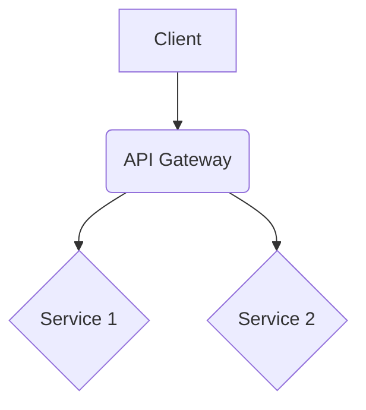

# System Patterns

*   **Related Brief:** projectbrief.md
*   **Last Updated:** 2025-04-19

## 1. Architecture Overview

[Provide a high-level description of the system architecture. Include diagrams if helpful (e.g., using Mermaid syntax).]

## 2. Key Technical Decisions

[Document major technical choices and their rationale.]

*   **Decision 1:** [Technology/Approach Chosen] - Rationale: ...
*   **Decision 2:** [Technology/Approach Chosen] - Rationale: ...

## 3. Design Patterns

[List the significant design patterns employed in the codebase.]

*   **Pattern 1:** [e.g., Repository Pattern] - Usage: [Where/How it's used]
*   **Pattern 2:** [e.g., Dependency Injection] - Usage: [Where/How it's used]

## 4. Component Relationships

[Describe how major components or modules interact.]

*   **Component A** interacts with **Component B** via [Mechanism, e.g., REST API, message queue].
*   ...

## 5. Critical Implementation Paths

[Highlight key workflows or data flows within the system.]

*   **Workflow 1:** [e.g., User Authentication Flow] - Steps: ...
*   **Workflow 2:** [e.g., Order Processing] - Steps: ...
